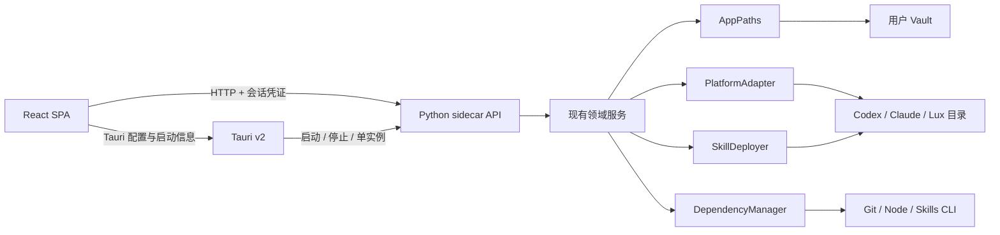

# Skills Vault 跨平台桌面化技术设计

## 1. 设计摘要

采用 Tauri v2 作为桌面生命周期和安装包边界，保留现有 React SPA 与 Python 领域服务。生产环境把 Python 服务冻结为平台专属 sidecar，由 Tauri 启动和关闭；开发环境继续运行 Python 源码，但通过同一个跨平台 Node 编排入口启动。

桌面化不改变 Catalog、Profile、Preview token、事务和备份的领域语义。主要改造集中在应用路径、平台目标目录、部署方式、外部依赖和进程生命周期五个适配边界。

## 2. 架构



### 2.1 保留边界

- React 页面、查询状态和 Operation Rail 保持现有职责。
- Python `Vault`、应用服务、Preview/Apply、事务和备份继续作为领域事实边界。
- JSON API 保留；桌面模式只增加启动会话、依赖诊断和 Vault 选择/迁移端点。
- 浏览器模式继续用于开发、诊断和应急，不作为默认分发入口。

### 2.2 新增模块

建议新增：

```text
server/skills_vault/
├── app_paths.py          # 应用资源、Vault、缓存、日志位置
├── platform_adapter.py   # OS、Agent 目录、可执行文件与能力探测
├── deployment.py         # symlink / managed-copy 策略
├── dependencies.py       # Git / Node / Skills CLI 检测和安装计划
├── migrations.py         # Vault schema 与旧项目迁移
└── runtime.py            # sidecar 启动参数、握手与关闭

src-tauri/
├── src/                  # 生命周期、单实例、sidecar 编排
├── capabilities/         # 最小 Tauri 权限
├── binaries/             # 当前 target triple 的 Python sidecar
└── tauri.conf.json

tools/
├── dev.mjs               # 跨平台开发进程编排
├── package.mjs           # 构建检查与打包编排
└── build-sidecar.py      # PyInstaller 构建入口
```

最终路径可以在任务拆分时微调，但职责不可重新混入页面或 Bash 脚本。

## 3. 运行模式

### 3.1 桌面生产模式

1. Tauri 获取单实例锁。
2. 解析应用配置中的 Vault 路径；首次启动进入 Vault 创建/选择流程。
3. Tauri 启动 Python sidecar，sidecar 绑定 `127.0.0.1:0`。
4. sidecar 通过标准输出发送单行 JSON 握手：端口、进程版本、Vault schema 和一次性启动标识。
5. Tauri 把 API 地址和短期会话凭证注入前端运行配置。
6. React 完成健康检查后进入主界面。
7. 退出时 Tauri 请求 sidecar 优雅关闭，超时后只终止自己创建且 PID/启动标识匹配的进程。

sidecar 不使用固定端口，也不写传统 PID 文件。Tauri 是桌面模式唯一的进程所有者。

### 3.2 桌面开发模式

`npm run dev` 由跨平台 Node 脚本完成依赖检测，并启动 Python 源码服务与 `tauri dev`。脚本直接使用参数数组创建子进程，不通过 Bash 字符串拼接；收到退出、Ctrl+C 或子进程失败时统一清理。

保留两个辅助入口：

- `npm run dev:web`：Vite + Python 浏览器模式；
- `python -m skills_vault ...`：诊断和自动化入口。

现有 Bash 脚本在过渡期保留并标记 deprecated，等三平台入口稳定后再通过单独确认移除。

## 4. 路径与数据所有权

### 4.1 路径模型

`AppPaths` 明确区分：

- `resource_root`：随应用安装，只读，包含前端产物、默认 Vault 模板和版本元数据；
- `config_root`：记录最近 Vault、窗口和诊断设置；
- `log_root`：桌面启动及 sidecar 崩溃日志；
- `vault_root`：用户选择的事实数据工作区；
- `cache_root`：可删除的构建、下载和探测缓存。

桌面模式使用平台标准用户目录，具体路径由 Tauri/平台目录库提供，不在领域代码中拼接 `Library`、`AppData` 或 XDG 路径。开发模式默认仍可显式使用仓库根目录。

### 4.2 初始 Vault

应用资源中只携带最小 Vault 模板，不携带开发者当前的个人数据。首次创建时复制：

- schema/version 文件；
- 空的 `registry.yaml`、`lock.yaml` 和受管 Profile；
- `my-skills/`、`annotations/`、`docs/skill-guides/` 的空结构；
- `.gitignore` 与可选本地 Git 初始化说明。

现有项目 Vault 通过“打开现有 Vault”使用。若 schema 旧于应用要求，则进入迁移 Preview，不静默改写。

### 4.3 Vault schema

新增独立 `vault.json` 或等价版本文件，至少记录 `schema_version`、`created_with` 和 `migrated_at`。应用版本与 Vault schema 分开演进，旧应用不得打开更高 schema 并继续写入。

### 4.4 首次启动与导入向导

桌面应用在没有有效 `vault_root` 时展示四个入口：

1. **创建新 Vault**：默认建议用户可见的 Documents 目录，允许自定义；复制最小模板，不要求 Git。
2. **打开已有 Skills Vault**：校验 schema 后原地使用；若 schema 较旧，进入迁移 Preview。
3. **导入 Skills 仓库或文件夹**：只读扫描所有 `SKILL.md`，再选择作为来源或作为原创 Skill 导入。
4. **迁移 Web v2 Vault**：识别代码与数据同根的现有 v2 项目，复制到独立 Vault 后重建可重建状态。

目录识别返回统一 `VaultCandidate`：类型、路径、schema、是否 Git 仓库、Skill 数量、无效项、嵌套项、冲突、预计复制大小和建议动作。

“作为来源”导入时，目标是 `sources/<source-id>/`：Git 仓库完整复制并保留 `.git`，非 Git 文件夹复制为 `local-copy` 来源；来源默认 `unreviewed`。用户要编辑来源 Skill 时仍通过 derive 进入 `my-skills/`。

“作为我的 Skills”导入时，只复制用户确认的 Skill 目录到 `my-skills/`，不携带外层仓库控制文件；每个目标计算指纹并逐项检查名称冲突。

### 4.5 Web v2 迁移

Web v2 迁移默认创建独立 Vault，原地打开仅作为兼容选项。迁移复制：

- `registry.yaml`、`lock.yaml`、`profiles/`、`annotations/`；
- `my-skills/`、`docs/skill-guides/`；
- `sources/` 及来源自身 Git 历史；
- 可解释的事务、更新报告和备份，统一标记为 legacy/history。

迁移不直接复制活动 `catalog/`、PID、端口、日志、Preview token 和 `install-state.json`。新 Vault 扫描后比较 Skill ID 与内容指纹；平台部署重指向必须使用独立的安装 Preview/Apply。迁移全程只复制，旧 Web 项目作为回滚副本保持不变。

## 5. 平台与部署适配

### 5.1 PlatformAdapter

平台适配器返回结构化能力，而不是散布 `sys.platform` 判断：

- 平台和架构标识；
- 用户主目录与 Codex / Claude Code / Lux Desktop 目标目录；
- 可执行文件候选名和扩展名；
- 是否支持 symlink；
- 默认部署策略；
- 可用安装提供者；
- 打开外部链接或目录的能力。

安装状态必须优先读取显式 `platform` 字段；旧状态迁移使用规范化 `Path.parts`，不再搜索 `"/.claude/skills/"` 之类字符串。

### 5.2 SkillDeployer

统一接口：

```text
plan(desired, current) -> DeploymentPlan
apply(plan, backup) -> DeploymentResult
verify(state) -> DriftReport
remove(managed_entry) -> RemovalResult
```

部署策略：

- Codex / Claude Code 继续部署完整 Skill 目录；Lux Desktop 把 `SKILL.md` 映射为 `~/.lux/skills/<name>.md`，完整 Skill 目录作为同名资源目录，并映射可选 watcher JSON；
- macOS/Linux 默认 `symlink`，Lux 的入口文件使用文件 symlink；
- Windows 默认 `managed-copy`，Lux 的入口文件使用 `managed-copy-file`，避免要求管理员权限或开发者模式；
- Windows 后续可在能力探测通过时允许用户选择目录链接，但不作为首版成功条件。

`install-state.json` 从单纯 `links` 升级为 `deployments`，每项记录：平台、Skill ID、目标路径、源路径、部署类型、安装时源指纹、安装时目标指纹和事务 ID。

移除或替换受管复制前重新计算目标指纹。目标已被用户修改时，不覆盖、不删除，状态进入 `blocked-user-change`，并提供比较和备份操作。

## 6. 外部依赖中心

### 6.1 能力模型

依赖中心检测：

- Git：路径、版本、是否可执行、受影响能力；
- Node/npm/npx：仅外部 Skills CLI 来源需要，不是桌面运行依赖；
- Skills CLI：先离线判断 npm/npx 是否可调用；只在用户主动重新检测或执行来源操作时通过受控 `npx --yes skills` 验证，不要求全局安装。

依赖状态使用 `available / missing / outdated / broken / unverified / checking`，API 返回结构化修复动作。应用启动时的初始检测不得触发网络请求。

### 6.2 安装策略

首版优先提供“可信安装计划”，不自行下载未知二进制：

- Windows：检测 WinGet 后可生成 Git/Node 安装计划；
- macOS：检测 Homebrew 后可生成安装计划，没有 Homebrew 时打开官方安装说明；
- Linux：根据发行版显示官方命令，默认不自动提权执行；
- Skills CLI：Node/npm/npx 可用后直接重新检测，无需常驻全局安装。

任何自动安装都必须：展示提供者、包名、命令、网络影响和权限需求；用户确认后执行；保存 stdout/stderr 摘要与事务记录；失败不改变 Vault。应用不得静默安装 Homebrew、WinGet、系统包管理器或管理员组件。

## 7. API 与安全

### 7.1 桌面会话

sidecar 使用随机高熵会话令牌。桌面请求携带 `Authorization: Bearer <token>`；令牌只存在于进程内存，不写入 Vault 或日志。健康检查可使用受限握手标识，所有数据与写入端点都要求令牌。

允许的桌面 Origin 使用构建配置中的精确白名单；浏览器诊断模式保留现有 localhost Origin 策略。CSP 只允许当前 sidecar 地址，不开放任意网络连接。

### 7.2 新增 API

- `GET /api/runtime`：应用、sidecar、Vault schema、平台能力；
- `GET /api/dependencies`：依赖检测结果；
- `POST /api/dependencies/refresh`：重新检测；
- `POST /api/dependencies/install/preview`；
- `POST /api/dependencies/install/apply`；
- `POST /api/vault/migration/preview`；
- `POST /api/vault/migration/apply`。
- `POST /api/vault/candidates/inspect`：只读识别已有 Vault、Git Skills 仓库或普通目录；
- `POST /api/vault/create/preview` 与 `POST /api/vault/create/apply`；
- `POST /api/vault/import/preview` 与 `POST /api/vault/import/apply`；
- `POST /api/skills/original/preview`：补齐原创 Skill 创建的写前预览。

继续使用统一错误 `{ code, error, details }`。新增核心错误包括 `dependency_missing`、`unsupported_platform`、`deployment_user_modified`、`vault_schema_newer` 和 `sidecar_session_invalid`。

## 8. 构建与打包

### 8.1 工具链职责

- Node.js：构建 React、运行跨平台编排脚本和 Tauri CLI；
- Rust：构建 Tauri 壳；
- Python + PyInstaller：生成当前平台 sidecar；
- Tauri bundler：生成平台安装包。

最终用户不需要 Node.js、Rust 或 Python。Git/Node/npx 只在用户启用相应外部来源能力时需要。

### 8.2 `npm run package`

统一流程：

1. 验证版本、工作区状态和平台工具链；
2. 运行前端类型、Lint、单测与生产构建；
3. 运行 Python 测试；
4. 用 PyInstaller 构建当前平台 sidecar；
5. 按 Tauri target triple 放置 sidecar；
6. 运行 Tauri build/bundle；
7. 生成 `checksums.json`、构建元数据和测试/签名状态；
8. 输出到 `dist/packages/<version>/<os>-<arch>/`。

PyInstaller 不是跨操作系统编译器，因此每个目标操作系统必须独立执行该流程。项目当前禁止 push，首版使用本地实体机或虚拟机构建；远程 CI 需要另立决定。

### 8.3 签名边界

- 未签名产物只标记为 internal/testing；
- macOS 对外分发前完成 Developer ID 签名和 notarization；
- Windows 对外分发前完成代码签名；
- 签名凭证只从本机安全环境读取，不写入仓库或构建日志。

## 9. 测试策略

### 9.1 Python

- 使用临时 Vault 与伪造 `PlatformAdapter` 覆盖三平台路径；
- 覆盖 symlink 与 managed-copy 的计划、应用、漂移、用户修改阻塞和恢复；
- 覆盖依赖缺失、版本解析、安装计划与命令白名单；
- 覆盖 Vault schema 初始化、迁移、失败回滚和更高版本拒写；
- 覆盖 sidecar token、Origin、随机端口和关闭端点。

### 9.2 TypeScript / React

- 覆盖首次启动、选择 Vault、依赖中心和受限能力呈现；
- 覆盖桌面 API 启动配置和 sidecar 不可用错误；
- 保留现有页面、选择、Preview/Apply 和可访问性测试。

### 9.3 Tauri 与真实系统

- Rust 单测覆盖启动参数和握手解析；
- 每个平台执行安装包烟测；
- Windows 必测非管理员用户、带空格/中文用户名和 managed-copy；
- macOS 必测 Apple Silicon、应用重启和未签名/签名构建标识；
- Ubuntu 必测 AppImage 启动、用户目录权限和外部依赖缺失。

## 10. 迁移与兼容发布顺序

1. 先引入适配接口，但让 macOS 现有行为继续通过旧入口运行。
2. 将安装状态迁移到带部署类型的新 schema，并保持旧 `links` 可读取。
3. 建立跨平台开发入口和路径测试。
4. 分离应用资源与 Vault，完成首次启动及旧 Vault 迁移。
5. 接入 Tauri 开发模式和 sidecar 会话。
6. 完成当前 macOS 安装包，验证不回归。
7. 完成 Windows managed-copy 与安装包。
8. 完成 Ubuntu AppImage。
9. 三平台验收完成后，将 Tauri 设为 README 默认入口，旧 Bash 入口降级为兼容工具。

## 11. 主要风险与控制

- **Windows 目标文件被用户编辑**：使用目标指纹阻止静默覆盖，先备份和比较。
- **应用升级损坏 Vault**：应用资源与 Vault 分离，schema 迁移必须 Preview/Apply。
- **sidecar 被冒用**：随机端口、会话 token、严格 Origin、单实例和父子进程绑定。
- **打包只在开发机成功**：每个平台独立构建和安装烟测，产物记录构建环境。
- **可选依赖变成隐性必需**：启动路径不探测网络；功能调用前返回明确能力缺口。
- **自动安装扩大权限**：只允许白名单提供者和包，执行前显示命令，不静默提权。

## 12. 技术依据

- Tauri v2 官方支持把 PyInstaller 生成的 Python CLI/API 服务作为 external binary sidecar：<https://v2.tauri.app/develop/sidecar/>。
- Tauri 提供 macOS、Windows、Linux 的安装包与签名分发能力：<https://v2.tauri.app/distribute/>。
- PyInstaller 支持 Windows、macOS、Linux，但要求在目标操作系统分别构建：<https://pyinstaller.org/en/stable/>。
- Claude Code 支持原生 Windows，因此 Windows 适配不应只实现为 WSL 路径：<https://code.claude.com/docs/en/getting-started>。
